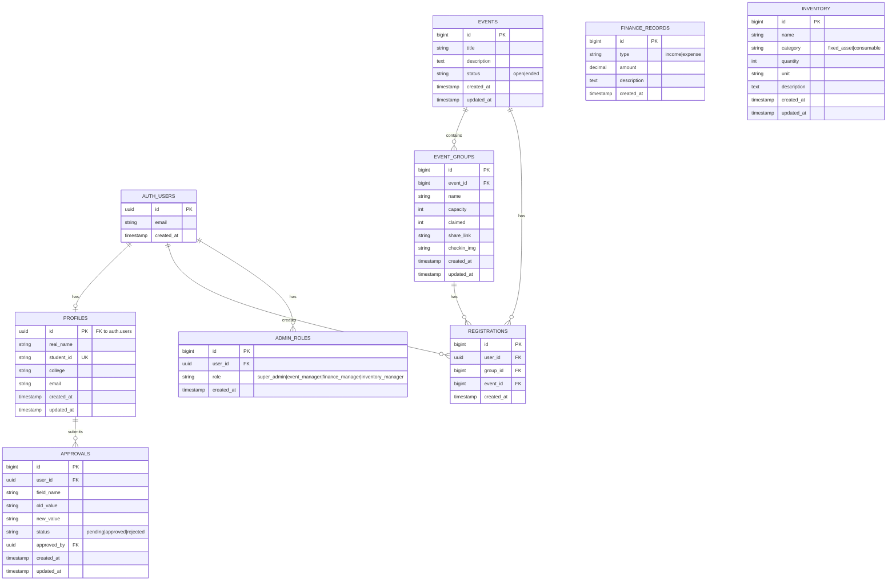

# 羽毛球社团数字化管理平台 - 架构设计

本文档使用 Mermaid 图表详细说明系统架构设计。

---

## 1. 系统整体架构图

---

## 2. 数据库 ER 图（实体关系图）

---

## 3. 用户活动报名流程图

---

## 4. 管理员权限控制流程图

---

## 5. 并发安全机制图

---

## 6. 技术栈层级图

---

## 7. 数据流向图

---

## 8. 安全防护层级图

---

## 9. 模块依赖关系图

---

## 10. 部署流程图

---

## 11. 系统扩展规划图

---

## 总结

本架构文档通过 11 张 Mermaid 图表，从不同维度展示了羽毛球社团数字化管理平台的技术架构：

1. **整体架构图**：展示前端、API、数据层的整体关系
2. **ER 图**：详细的数据库表结构和关系
3. **活动报名流程图**：核心业务流程的时序图
4. **权限控制流程图**：管理员权限验证逻辑
5. **并发安全机制图**：解决超卖问题的技术原理
6. **技术栈层级图**：各层技术选型
7. **数据流向图**：数据在系统中的流动路径
8. **安全防护层级图**：多层次安全防护机制
9. **模块依赖关系图**：代码模块间的依赖关系
10. **部署流程图**：CI/CD 自动化部署流程
11. **系统扩展规划图**：未来功能规划脑图

这些图表可以帮助开发者快速理解系统设计，也可用于技术文档、团队培训和对外展示。
